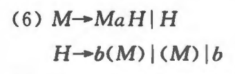
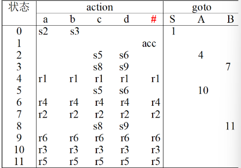

# 4. 自顶向下分析

> **老师录音**
>
> 判断LL(1)文法。算first、follow、select集
>
> LL(1) 分析过程。预测分析表
>
> 消除左递归和左公共因子。P101 题 6-6
>
> 写递归下降分析子程序。P88、P89。注意空规则的写法

确定的自顶向下分析是语法分析的一种方法。它从文法开始符出发，按照输入串从左到右的顺序，逐步推导出输入串，并且在每一步选择产生式时，唯一确定该用哪条产生式

LL(0) 分析中，L 代表从左往右读取符号串，R 表示最左推导过程，数字 0 表示每次只查看一个输入符号即可唯一确定产生式

##  4.1. 表驱动 LL(1) 分析

过程概述：消除左递归和左公共因子，求 FIRST 集、FOLLOW 集、SELECT 集，判断是否为 LL(1)，构造预测分析表求解

### 消除左递归和左公共因子

在构造 LL(1) 分析表之前，通常要依次消除文法中的左递归和左公共因子

形如 $A\rightarrow A\alpha_1| \cdots| A\alpha_n| \beta$ 是直接左递归，可以推导出类似结构的是间接左递归。

想消除直接左递归，要引入新的非终结符，把产生式替换为如下形式的右递归：
$$
A\rightarrow \beta A',
A'\rightarrow \alpha_1 A'| \cdots| \alpha_n A' | \varepsilon
$$
想消除间接左递归，两两遍历所有非终结符的推导关系 $A_i\Rightarrow A_j y$，如果满足 $A_j\rightarrow x_1 | x_2|\cdots$，则改写为 $A_i \rightarrow x_1y| x_2y| \cdots$

形如 $A\rightarrow \alpha \beta_1 |\cdots | \alpha\beta_n|
 \gamma$ 的就是左公共因子。想消除其左公共因子，要提取公共因子 $\alpha(\cdots)$ 并引入非终结符，把产生式替换为：
$$
A\rightarrow \alpha A' | \gamma,A'\rightarrow \beta_1|\cdots |\beta_n
$$

例题：




### First 集

在文法 $G=(V_T, V_N, S, P)$ 中，
$$
First(\beta)=\lbrace a | a\in V_T\land \beta \overset{*}\Rightarrow a.\cdots \rbrace
\cup (\text{if }\beta\overset{*}\Rightarrow \varepsilon\text{ then }\varepsilon),\beta \in V^*
$$
定义太复杂，直接看解释：$First(\beta)$ 集表示句型 $\beta$ 能推导出的字符串（包括自身）中，可能出现在开头的终结符集合。计算 First 集时，可以画出语法树，只取最左边的非终结符，遇见 $\varepsilon$ 才往右看

### Follow 集

$Follow(A)$ 表示在所有句型中，可能紧跟在非终结符 $A$ 后面的终结符集合。
$$
\begin{align*}
Follow(A)=&\lbrace a | a\in V_T\land S \overset{+}\Rightarrow \cdots .Aa. \cdots \rbrace
\\
&\cup(\text{if }S \overset{*}\Rightarrow \cdots.A \text{ then }\lbrace \# \rbrace)
\end{align*}
$$
计算 Follow 集时可以转换为求 First 集：

1. 先令 $Follow(S)=\lbrace \# \rbrace$

2. 若有产生式 $Y\rightarrow \alpha X \beta$，如果 $\varepsilon \notin First(\beta)$，则 $Follow(X)$ =$First(\beta)$，否则 $Follow(X)$ = $(First(\beta)-\lbrace \varepsilon \rbrace) \cup Follow(Y)$

3. 重复上述过程，直到 $Follow(X),X\in V_N$ 收敛


在步骤 2 中，如果 $\beta$ 的推导结果不包含空，则 $X$ 的后续必然只取决于 $\beta$；但是如果 $\beta$ 的推导结果可能为空，则要考虑 $Y$ 后面可能出现的终结符

### Select 集

$Select(A\rightarrow \beta)$ 表示使用产生式 $A\rightarrow \beta$ 后，所有可能的出现在 $A$ 原来位置的终结符集合，可以指导什么时候下该使用产生式 $A\rightarrow \beta$
$$
Select(A\rightarrow \beta)=
\left\{ \begin{matrix}
	First(\beta),
		\text{当 $x\notin Fisrt(\beta)$}\\
	(First(\beta)-\{ \varepsilon \})\cup Follow(A),
		\text{otherwise}
\end{matrix} \right.
$$

### LL(1) 文法的判定

任一文法是 LL(1) 文法的充要条件：对于每个非终结符，均满足同一个非终结符的所有产生式，其 select 集之间没有交集

比如如 $Select(A\rightarrow \alpha)\cap Select(A\rightarrow \beta)=\emptyset$

### 预测分析表

确定自顶向下分析通常可以用预测分析表实现

预测分析表可用二维矩阵 $M(A, a)$ 表示，其每一个元素都是一个产生式元素，它说明在用非终结符 $A$ 向下推导时遇到输入符号 $a$ 应该选择的产生式

预测分析表可由 $Select$ 集得出
$$
M(A, a)=A\rightarrow \alpha\text{, when }a\in Select(A\rightarrow \alpha)
$$

### 例题

给定文法 $G[E]$
$$
\begin{align*}
E &\rightarrow TE' \\
E' &\rightarrow +TE' | \varepsilon \\
T &\rightarrow FT' \\
T' &\rightarrow *FT' | \varepsilon \\
F &\rightarrow i | (E)
\end{align*}
$$
求所有非终结符的 First 集、Follow 集

| 非终结符 | First 集   | Follow 集  |
| -------- | ---------- | ---------- |
| E        | $\{i, (\}$ | $\{\#,)\}$ |
| T        |            |            |
| F        |            |            |
| T'       |            |            |
| E'       |            |            |

求所有产生式的 Select 集：

$$
\begin{align*}
\text{Select}( E \to TE' ) &= \text{first}(TE') = \{ i, ( \} \\
\text{Select}( E' \to +TE' ) &= \text{first}(+TE') = \{ + \} \\
\text{Select}( E' \to \varepsilon ) &= \text{first}(\varepsilon) \cup \text{follow}(E') = \{ ), \# \} \\
\text{Select}( T \to FT' ) &= \text{first}(FT') = \{ i, ( \} \\
\text{Select}( T' \to *FT' ) &= \text{first}(*FT') = \{ * \} \\
\text{Select}( T' \to \varepsilon ) &= \text{first}(\varepsilon) \cup \text{follow}(T')= \{ +, ), \# \} \\
\text{Select}( F \to i ) &= \text{first}(i) = \{ i \} \\
\text{Select}( F \to (E) ) &= \text{first}((E)) = \{ ( \}
\end{align*}
$$
判断是否是 LL(1) 文法：求 select 集交集，略

写出 `i+i` 的 LL(1) 分析过程：

按照如下格式解题，`#` 代表栈底，即字符串的结尾

| 分析栈 S   | 剩余输入串 | 推导所用产生式或匹配         |
| ---------- | ---------- | ---------------------------- |
| #**E**     | **i**+i#   | $M(E, i)=E\rightarrow TE'$   |
| #E'**T**   | **i**+i#   | $T \rightarrow FT'$          |
| #E'T'**F** | **i**+i#   | $F\rightarrow i$             |
| #E'T'**i** | **i**+i#   | Match                        |
| #E'**T'**  | **+**i#    | $T' \rightarrow \varepsilon$ |
| #**E'**    | **+**i#    | $E'\rightarrow +TE'$         |
| #E'T**+**  | **+**i#    | Match                        |
| #E'**T**   | **i**#     | $T\rightarrow FT'$           |
| #E'T'**F** | i#         | $F\rightarrow i$             |
| #E'T'**i** | **i**#     | Match                        |
| #E'T'      | #          | $T'\rightarrow \varepsilon$  |
| #E'        | #          | $E'\rightarrow \varepsilon$  |
| #          | #          | 可接受                       |


## 4.2. 递归下降 LL(1) 分析程序

递归下降法（也称递归子程序）为每个非终结符都生成相应的语法分析子程序，其逻辑由产生式给出。在运行时，终结符产生匹配命令，非终结符则调用对应的子程序

### 不懂

例如产生式 $A\rightarrow \beta_1| \cdots| \beta_n$，其对应的子程序伪代码为

```fortran
procedure A ()
begin
	if SYM ∈ Select(A→β1) then P(β1)
	else if SYM ∈ Select(A→β2) then P(β1)
	......
	else if SYM ∈ Select(A→βn) then P(βn)
	else ERROR();
end
```

上述程序中，`SYM` 表示输入符号

如果 $\beta$ 是多个符号 $X_i$ 组成的，则按顺序执行所有符号的子程序 $P(X_i)$。若 $X_i\in V_T$ 是终结符，则其子程序就是匹配命令

### 示例

给定文法
$$
S\rightarrow aBa\\
B\rightarrow bB| c
$$
写成类似 C 语言的形式


# 5. 自底向上优先分析

从输入符号出发，逐渐规约到开始符号

移进-归约分析是最常见的自底向上分析技术，其过程可概述如下：

1. 移进：从左往右，把符号串逐个入栈
2. 如果栈顶部分是某个句柄（可以被推导出），归约这个句柄。否则继续移进
3. 当栈中仅剩开始符且输入符号串读取完毕，接受字符串


# 6. LR 分析

LR 分析中，L 代表从左往右读取符号串，R 表示最右推导的逆过程（最左规约）。LR 分析是当前最广泛应用的无回溯移进-归约方法

> 老师录音
>
> 关注前两个 LR 分析方法
>
> 三道题：要会画前两个方法的 DFA 自动机；分析过程；判断 **LR(0)**、SLR(1) 文法

## 6.1. LR(0) 分析

### 活前缀

活前缀是规范句型中、不超过句柄的前缀。活前缀描述了分析栈可能出现的合法状态，并指导我们应该移进还是归约

### 构建识别活前缀的 DFA

为了高效识别活前缀，可以构建 DFA，进一步构建分析表

这里引入几个概念

- 项目：有产生式 $A\rightarrow \alpha\beta$，那么在右部加个圆点就构成项目，如 $A\rightarrow ·\alpha\beta$、$A\rightarrow \alpha ·\beta$、$A\rightarrow \alpha\beta ·$。圆点的含义是，这个产生式有部已经识别到了哪里
  - 移进项目：$A\rightarrow \alpha ·a\beta,a\in V_T$
  - 待约项目：$A\rightarrow \alpha ·\beta$。$A\rightarrow \varepsilon$ 的项目是 $A\rightarrow ·$ ，是规约项目
  - 规约项目：$A\rightarrow \alpha ·$，圆点后面已经没有符号
  - 接受项目：$S'\rightarrow S$

- `CLOSUSE` 闭包：这里的闭包就是 DFA 里的状态。对于已经在闭包内的形如 $A\rightarrow \alpha·B\beta,B\in V_N$ 的项目，把 $B$ 的所有产生式转化为项目 $B\rightarrow ·\gamma$ 也加入闭包内。若新项目的圆点后面又是非终结符，循环前面过程
- `GO` 状态转移：如果某个状态 $I$ 中有项目 $A\rightarrow \alpha·X\beta,X\in V$，且识别了 $X$，就把原点后移成 $A\rightarrow \alpha X·\beta,X\in V$，再对新的项目求闭包。新的闭包记为 $GO(I, X)$


DFA 的构建方法概述如下：

1. 拓广文法：加入新的开始符号 $S'\rightarrow S$
2. 构建初态 $S'\rightarrow ·S$，计算其闭包
3. 遍历闭包内的项目，根据原点后的符号，计算 $GO(I, X)$
4. 如果得到新的非空项目集，则作为新状态加入 DFA
5. 重复 3、4 步，直到没有新状态


LR(0) 项目集规范族就是 DFA 的所有状态集合

### 例题

已知拓广文法
$$
\begin{align*}
&(0) \quad S' \rightarrow S \\
&(1) \quad S \rightarrow aA & (2) \quad S &\rightarrow bB \\
&(3) \quad A \rightarrow cA & (4) \quad A &\rightarrow d \\
&(5) \quad B \rightarrow cB & (6) \quad B &\rightarrow d
\end{align*}
$$
初态 $I_0=closure(\{S'\rightarrow ·S\})=\{ S'\rightarrow ·S, S\rightarrow ·aA, S\rightarrow ·bB\}$，

状态转移：

- $GO(I_0,S)=\{S'\rightarrow S·\}$，得到新状态

- $GO(I_0, A) = closure(\{S\rightarrow a·A\}) = \{A \rightarrow ·cA,A \rightarrow ·d \}$，得到新状态

- $GO(I_0, B) = closure(\{S\rightarrow b·B\}) = \{B \rightarrow ·cB,A \rightarrow ·d \}$，得到新状态


其余推导过程省略，画出 DFA 图如下


（手写补充）

### 构造 LR(0) 分析表

以上述例题为例，根据 DFA 构建分析表

首先构建 `ACTION` 表

- 移进：若 $GO(I_k,a)=I_j$，即状态 $I_k$ 接受 $a$ 后转移到 $I_j$，在表格 k 行 a 列 `(k, a)` 处写下 $S_j$（S 代表 Shift）
- 规约：若  $I_k$  包含 $A\rightarrow \alpha ·$ 的形式，且 $A\rightarrow \alpha$ 是第 n 个产生式 ，就在表格第 k 行全部写下 $r_n$（r 代表 reduce）
- 接受：若 $I_k$ 包含 $S'\rightarrow S·$，在表格 k 行 # 列写下 `acc`


其格式如下：

| 状态 | 终结符1：a | 终结符2：b | ...  | #    |
| ---- | :--------: | ---------- | ---- | ---- |
| 1    |            |            |      |      |
| 2    |            |            |      |      |
| ...  |            |            |      |      |


接下来构建 `GOTO` 表

状态转移：若 $GO(I_k, A) = I_j$，即状态 $I_k$ 接受 $A$ 后转移到 $I_j$，在表格 k 行 A 列 `(k, A)` 处写下 `j`

其格式如下：

| 状态 | S    | 非终结符1：A | 非终结符2：B | ...  |
| :--: | ---- | ------------ | ------------ | ---- |
|  1   |      |              |              |      |
|  2   |      |              |              |      |
| ...  |      |              |              |      |

上述例题的分析表格如下：



### LR 分析程序

得到分析表后，可以列出如下表格对任意输入串做 LR 分析。这里用上述例题做示范

| 步骤 | 符号栈 | 状态栈 | 输入符号串 | ACTION | GOTO |
| :--: | ------ | ------ | :--------: | ------ | ---- |
| 1）  | #      | 0      |    bcd#    | S_3    |      |
| 2）  | #b     | 03     |    cd#     | S_8    |      |
| 3）  | #bc    | 038    |     d#     | S_9    |      |
| 4）  | #bcd   | 0389   |     #      | r_6    | 11   |
| 5）  | #bcB   | 038 11 |     #      | r_5    | 7    |
| 6）  | #bB    | 037    |     #      | r_2    | 1    |
| 7）  | #S     | 01     |     #      | acc    |      |

LR 分析过程维护 3 个东西：符号栈、状态栈、输入符号串。状态栈最右边的表示当前状态

ACTION 表回答的问题是，当前状态下，看到当前输入符号，应该干什么；GOTO 表只有在规约后才使用 GOTO 表

每次运行时的步骤概述为：根据当前状态 `i` 和输入符号 `a` 查找 `ACTION(i,a)`

- 若为 $S_j$ 则将 `a` 压入符号栈，将 `j` 压入状态栈
- 若为 $r_n$ 就按第 `n` 条产生式对符号栈进行归约。符号表和状态栈弹出相同次数。根据规约后的非终结符 $A$ 和新的状态 `x`，将状态 `GOTO(x, A)` 压入状态栈
- 遇到 `acc` 就接受该符号串


### LR(0) 文法的判定

先根据文法构造 LR(0) 项目集规范族，再构建 ACTION、GOTO 表。如果表的同一个格子内需要填两个动作，则发生冲突。有冲突就不是 LR(0) 文法

如果这两个动作是 `S, r`，则称为 `移进-归约冲突`；如果是 `r, r` 则称为 `归约-归约冲突`


## SLR(1) 分析

SLR(1) 解决了绝大部分 LR(0) 的冲突

对比 LR(0)，SLR(1) 只在填表时的规约规则有区别：

- LR(0) 中，若状态  $I_k$  包含 $A\rightarrow \alpha ·$ 的形式，且 $A\rightarrow \alpha$ 是第 n 个产生式 ，在表格第 k 行全部写下 $r_n$（r 代表 reduce）。
- SLR(1) 中，只在符号 $a\in FOLLOW(A)$ 的终结符处写下 $r_n$

### SLR(1) 的判定

先根据文法构造 LR(0) 项目集规范族，再用 SLR(1) 的规则构建 ACTION、GOTO 表。如果表的同一个格子内需要填两个动作，则发生冲突。有冲突就不是 SLR(1) 文法

## LR(1) 分析

LR(1) 引入了向前搜索符

### 构建 LR(1) 项目集规范族（待补充）