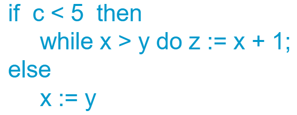

# 7. 语法制导的语义计算

语法分析只能说明结构合理，语义分析则在这些结构里填上了实际信息

> **老师录音**
>
> 掌握三种方法：
>
> 已知属性文法和动作画语法树；
>
> 已知属性文法，问他的作用；
>
> （重点关注、最难）给出基本文法，怎么设计动作（比如计算出括号个数和嵌套深度）？

## 7.1. 属性文法

属性文法是三元组 $(G, V, F)$。其中 $G$ 是上下文无关文法，$V$ 是属性集，$F$ 是语义计算规则集。例如：
$$
\begin{align*}
&S \rightarrow ABC \quad \{(A.num=B.num)and(B.num=C.num)\} \\
&A \rightarrow A_1 \quad \{A.num:=A_1.num+1\} \\
&A \rightarrow a \quad \{A.num:=1\}
\end{align*}
$$
在文法的基础上，为每个文法符号 $X$ 关联有特殊意义的属性 $a$，表示为 $X.a$。如果一条产生式有多个相同符号，则用数字下标来区分。此外，属性文法还为每一条产生式关联了语义计算规则集合

属性文法就是在清楚输入串的结构后，如何从一个个分散的终结符自底向上地推导到整个程序的语义。比如一段识别二进制数字的属性文法，能从一个个 `01` 推导出整个数字的数值是多少

这些语义规则和属性的设计取决与属性文法的实际作用

### 属性分类

综合属性：子节点传给父节点的属性，例如表达式 `3+4` 的值是 `7`

继承属性：子节点继承父节点的属性，例如变量声明的类型信息 `int x`

### S-属性文法

S-属性文法只包含综合属性，通常使用自底向上的分析方法

例题：用（带标注的）语法分析树对简单表达式求值（P190 题3）

（手写补充）

### L-属性文法

L-属性文法不仅包含综合属性，还允许继承属性（不过只能自上而下、自左而右地继承），可以使用自顶向下的分析方法如表驱动 LL(1)

## 7.2. 翻译模式

翻译模式是一种和属性文法类似的描述方法，它将语义规则直接插入到产生式之中，而不是放在最右边。

比起属性文法，综合属性的计算同样放在产生式的末尾，但是继承属性的计算要插到其文法符号前面

翻译模式中的动作在分析器识别出它左边相邻的那个文法符号时会立即执行。写成翻译模式便于进一步细化递归下降分析子程序的代码，在有占位符的伪代码中增加类型、语句

# 8. 中间代码生成

> **老师录音**
>
> P201 图 8.4 的符号表
>
> 例题翻译成三地址代码序列

## 8.1. 符号表

（以 PL/0 符号表为例）PL/0 只有常量、变量、过程三类标识符，符号表中需要记录他们的类别信息

- 变量标识符、过程标识符需要记录他们所在的层次。主过程的层次为 `0`
- 常量标识符则需要记录他们代表的常数值
- 在代码生成时，还需要记录变量相对于基址的偏移量。多个变量依次为 `DX+0`、`DX+1`、`DX+2`...`DX=3` 表示前三个单元用于存放控制信息
- `size` 为 `DX+变量的个数`

## 8.2. 抽象语法树

树中的根节点对应运算，叶结点对应运算所需参数。直接看示例就行

（手写补充）

## 8.3. 三地址代码（TAC）

三地址代码是常用的中间代码，它把复杂表达式拆成一条条简单语句，一条语句中最多出现三个地址

每条指令的格式为 `x := y op z`，其中 `x` 是结果地址，`x, y` 是两个操作数的地址。这里的地址可以是内存地址变量名、常量、临时变量等。这里介绍几个 TAC 语句：

- `x := x op y`：`:=` 表示赋值，`x op y` 表示二元运算
- `if x relop y goto L`：`if x relop y` 表示条件判断，`relop` 是关系运算，`goto L` 表示跳转到标号 `L`

### 赋值语句的翻译

给定属性文法，把指定符号串翻译为 TAC。

属性 `place` 表示变量在存储空间的位置；语义过程 `gen` 产生一条 TAC 指令；语义过程 `newtemp` 产生临时变量并返回地址；语义过程 `lookup(id.name)` 返回变量的地址

### 布尔表达式的翻译

布尔表达式的语义翻译有两种常见思路。一是把布尔表达式当成普通表达式，计算出一个值，再放入条件判断；二是把布尔表达式翻译成跳转代码，在布尔表达式较多时会出现复杂的跳转逻辑

### 控制语句的翻译

哎呀不管了，直接记结构

`if a>b then max:=1`

（手写补充）

`while a>b do a:=a+1`

（手写补充）

### 重点例题

以下语句翻译成 TAC

