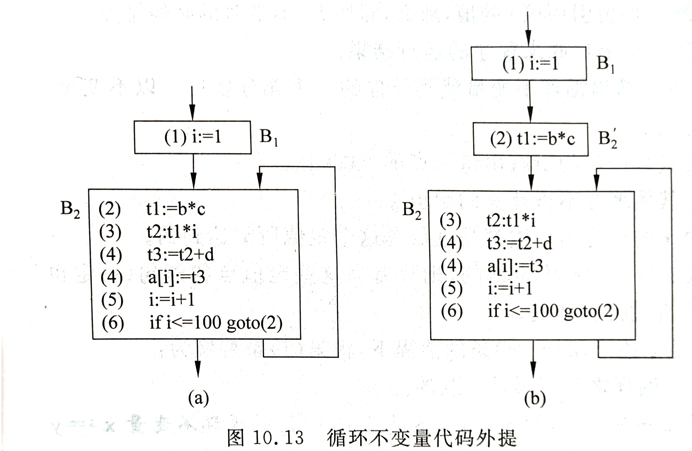
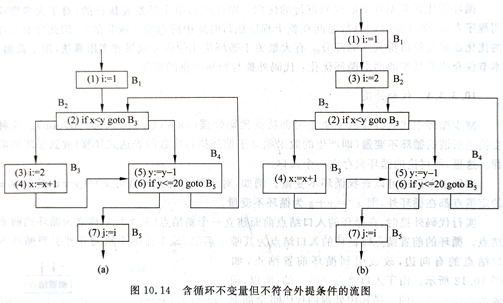
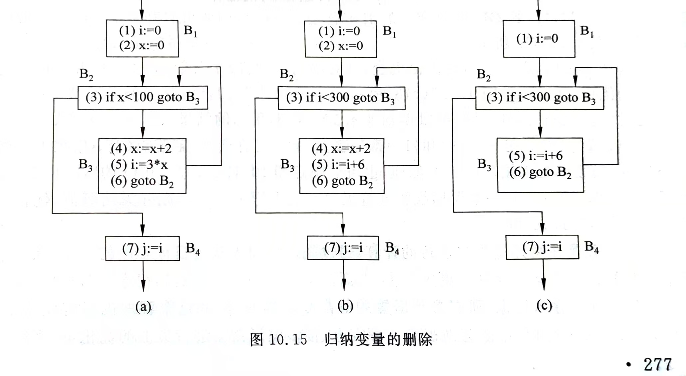

# 9. 运行时存储组织

> **老师录音**
>
> P252 题2、题3 一定要过关，多关注题2
>
> RA 不用写确切值，要背下 SL、DL、RA 的实际意义及它们的顺序

## 9.1. 概述

程序运行时，操作系统会分配给它一整块虚拟内存。编译器把这整块地划分成几个逻辑区域（从高地址到低地址）：

|         区域         |         解释         |
| :------------------: | :------------------: |
|         保留         | 为操作系统保留的区域 |
|        栈空间        |                      |
|        堆空间        |                      |
|       静态数据       |     存放全局数据     |
| 共享库和分别编译模块 |                      |
|         代码         |                      |
|         保留         |                      |

## 9.2. 活动记录分配

存储分配策略有三种，分别是静态存储分配、栈式存储分配、堆式动态分配。这里重点介绍栈式存储分配，他的存储单位是**活动记录**（AR，Activation Record）

### 过程的活动记录

过程的活动记录是运行栈上的栈帧。它是一个连续的存储区，记录一个过程（或函数）一次执行需要的信息，例如局部变量、返回地址、返回值等。活动记录在过程调用时创建，过程返回时撤销

栈帧的首地址用基址寄存器 `FP` 表示，指向第一个单元；栈顶用 `TOP` 表示，指向第一个为空的单元。`$FP, $TOP` 表示取地址。新增数据对象时从栈顶增加

在活动记录内部，数据都是按照首地址偏移量来访问的

### 嵌套过程中的栈式分配

在不涉及嵌套定义的情况下，一个过程只需要访问它自己的活动记录就够了。嵌套定义时，则可能出现对其他活动记录的访问，称为非局部量的访问

为了让过程可以引用包围它的外层数据，需要跟踪每个外层活动

PL/0 程序最低位三个单元一般是控制信息（对应第 8 章的 `DX=3`）。从低到高依次为：

- 静态链 `SL`，指向定义改过程的直接外过程最新一次运行的活动记录的基址，解决嵌套访问下的**变量作用域**
- 动态链 `DL`，指向调用该过程的栈帧基址（**调用过程**）
- 返回地址 `RA`，记录当前过程执行结束后，应该回到调用者代码的哪个位置继续执行

例题 P252 题 2

### Display 表

在多层嵌套时，用静态链访问外层本质上就是链表，较为低效。Display 表则以数组形式提升了效率 

Display 表维护一个数组 `D[0..max_depth]`，其中 `D[i]` 始终指向当前活跃的、层数为 `i` 的最内层过程的栈帧基址。这里的层数指的是过程在定义时嵌套的次数，主程序层数为 `0`

如果只维护一个全局 Display 表，则需要在栈帧内新增一个单独的 Display 表项。在调用过程（进入新层 `n`）时，把 `D[n]` 备份到新栈帧的 Display 表项，把 `D[n]` 更新为新栈帧的基址；在返回过程时（退出当前帧）时，把退出栈帧的 Display 表项写回 `D[n]`

例题：P252 题 3，P253 题 5

## 9.3. 参数传递

参数传递分为：

- 传值调用，如 C 语言的形参
- 传地址调用，如 C 语言的指针
- 传值结果调用，过程结束后再把结果复制出来
- 传名字调用，在过程体中每次用到形参时，实时地读取对应的实参。如果实参是表达式（如 `a[i]`），也会实时计算

# 10. 代码优化

> **老师录音**
>
> 关注两道题、三张图
>
> P292 题 2、P293 题 3，注意基本块的划分
>
> P275 图 10.13、P276 图 10.14、P277 图 10.15

优化前后，代码语义不发生变化

## 10.1. 基本块

基本块是指程序中一段顺序执行的语句系列，只有一个入口语句和一个出口语句。其中，入口语句的判定规则为：

- 程序的第一个语句
- 跳转语句的目标语句
- 跳转语句后面的语句

列出所有的入口语句后，从一个入口语句，到下一入口语句（前一句）或跳转语句（包含）或停机语句（包含），这中间的语句序列就是一个**基本块**

不在基本块内的语句，都是程序中无法到达的语句，可以删掉

### 流图

以基本块为结点集，根据程序运行方向画出的有向图就是流图。

基本块 `B_i` 指向 `B_j`，当且仅当：`B_i` 的出口语句跳转到 `B_j` 的入口语句；或 `B_j` 在 `B_i` 后面，且 `B_i` 的出口语句不是无条件跳转、停机、返回

## 10.2. 局部优化

局部优化就是在一个基本块内部进行优化。它包括合并已知变量，删除公共子表达式，削弱计算强度，复写传播，删除无用赋值

可以借助 RAG 图完成这些优化

## 10.3. 循环优化

### 循环结构的识别

在流图的基础上识别循环。给出如下定义：

- 从首结点出发，每一条到达结点 `n` 的路径都必须经过 `m`（`m, n`可以相同，也可以是首结点），则称 `m dom n`。`m` 为 `n` 的前驱，反之称后继
- 若 `m dom n`，且存在从 `n` 回到 `m` 的有向边，则称这条边为**回边**
- 在流图中，给定回边 `n->m`。**自然循环**包含 `n, m` 和所有不经过 `m` 就能到达 `n` 的结点

如果要识别循环，则先算出所有 `dom` 关系，然后逐个算回边、自然循环

### 循环不变代码外提

执行代码外提外提时，须在循环的入口结点前面建立一个基本块，外提的代码都存放到这里

以三地址语句 `x := x op y` 为例，如果 `y, z` 在循环中不变，则认为语句是循环不变的。循环不变的语句想要外提到前置基本块，还需要满足一些条件，例如：

- 所在结点是所有出口节点的支配结点（想要出循环必须执行语句）
- 没有其他对 `x` 的赋值语句
- 不产生副作用
- 其他

### 归纳变量的删除

在循环中，如果变量 `i` 在每次重复都固定地增加/减少某个常量，则称其为循环的**归纳变量**。如果`i` 只有 `i:=i+C` 类型的赋值，则称它为基础归纳变量

如果有多个归纳变量，那么他们的个数往往可以减少（例如表示为基础归纳变量的线性表达式）

